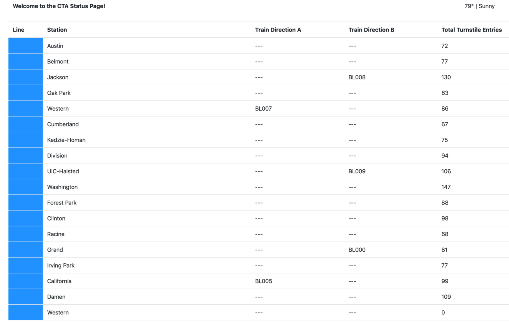
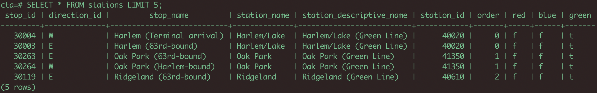
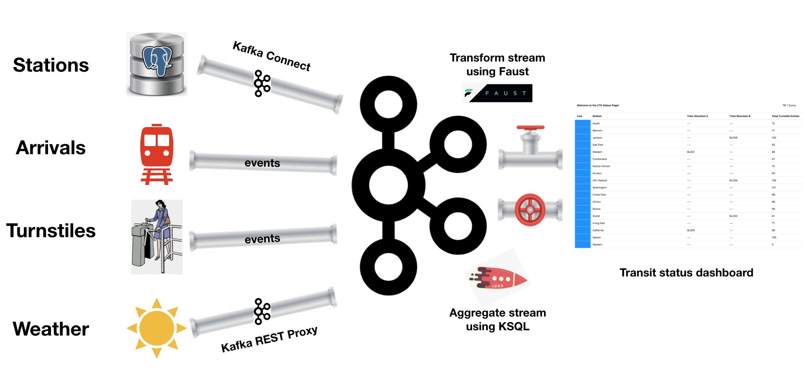

# Data-Streaming-Using-Kafka
**Project Description**: The Chicago Transit Authority (CTA) is interested in developing a data dashboard that displays the status of trains for its commuters. As their data engineer, I was tasked to build a **real-time stream processing data pipeline** that will allow the *train arrival* and *passenger turnstile* events emitted by devices installed by CTA at each train station to **flow** through the data pipeline into a `Transit Status Dashboard`. Shown below is the dashboard which shows the train arrivals, aggregated turnstile data and weather information.

  

**Data description**: There are three main data sources:
- Information for each of the 230 stations is located in a Postgres database table called `Station` which needs to be leveraged to display station information on the dashboard.
  * Shown below is the screenshot of the first few rows:

- The train arrival and passenger turnstile events are emitted by devices installed at each station.
  * Each train arrival event has the following fields: `{"station_id", "train_id", "direction", "line", "train_status", "prev_station_id", "prev_direction"}`
  * Each turnstile event has the following fields: `{"station_id", "station_name", "line"}`
- The Weather data is periodically loaded by extracting the data from the REST endpoint. It has the following fields: `{"temperature", "status"}`

## Project architecture:
 Since our goal is to get data from disparate systems to the dashboard, we can make use of Kafka and its ecosystem as an intermediary. Shown below is the high-level architecture of the flow of data into and out of Kafka using various components of the Kafka ecosystem, such as: `Kafka Connect` to ingest data from the database, `Kafka REST Proxy` to interface with a REST endpoint, `KSQL` to aggregate turnstile data at each station, `Faust` to transform the stream/table before it is consumed by the web server application running the dashboard.



## Project implementation:
The entire project is implemented in Python using `confluent_kafka`, `faust`, `KSQL` and other packages. The best way to understand the implementation is to focus on the producers first, then the role of stream processors in doing ETL and finally the consumers - which will load the data into the dashboard.

***Producers:*** A producer is one that will load data into our Kafka cluster. In our case, there are 3 types of producers that emit data into the Kafka topics - the place where we store data in the Kafka Cluster.

* **Native Kafka Producers**: The first type of producer makes use of `confluent_kafka` library to emit messages into Kafka Topics. The `KafkaProducer` base class provides core-functionality of a producer that is needed by other producers. The two producers: `Station` and `Turnstile` produce **train arrival** and **turnstile** information into our Kafka cluster. Arrivals will simply indicate that a train has arrived at a particular station and a turnstile event will simply indicate that a passenger has entered the station. The following topics store the events:
  * TOPIC: `org.chicago.cta.station.arrivals`: train arrival events
  * TOPIC: `org.chicago.cta.turnstiles`: turnstile events
* **REST Proxy Producer**: The second type of producer is a `REST Proxy Producer`. So, this will be a python script, that simply runs and periodically emits weather data via REST Proxy and puts it into Kafka topic:
  * TOPIC: `weather`: weather data
* **Kafka Connect Producer**: The third type of producer is simply a `Kafka Connect` JDBC source connector, which is going to connect to Postgres and extract data from a `stations table` and places it into Kafka topic:
  * TOPIC: `org.chicago.cta.stations`: contains `Station` records

***Stream Processors***: As depicted in the architecture diagram, I made use of two stream processors to perform some ETL tasks:
- `Faust` stream processing framework is used to *transform* input `Station` records into `TransformedStation` records that are stored in a new topic:
  * TOPIC: `org.chicago.cta.stations.transformed`: Contains `TransformedStation` records of the format `{"station_id", "station_name", "order", "line"}`. If you observe the original `Station` records (shown in the screenshot in the data description section), you will notice that `Station` records does not have a `line` field. We construct this line from the fields: `red`, `blue`, `green`- this is one of the transformations that is performed by `faust_stream.py`. The second transformation is that we discard some of the columns we don't need.

- `KSQL` is used to create two tables:
  * *TURNSTILES*: This table is constructed from the `org.chicago.cta.turnstiles` topic.
  * *TURNSTILES_SUMMARY*: This table holds the aggregated view of turnstile data by station. Since we are modifying the data, a new topic will be automatically created with the same name: *TURNSTILES_SUMMARY*. **NOTE**: Since we created this table using a `CREATE TABLE .. AS SELECT .. ` way, an aggregation query will be running on the KSQL server, that will, in real-time, keep updating the TURNSTILE_SUMMARY table with turnstile event counts per station.

***Consumers:***: With all of the data in Kafka, our final task is to consume the data in the web server that is going to serve the transit status pages to our commuters. To accomplish this we essentially need to have 4 consumers that extract messages from the topics that we created above:
- *Weather*: To consume messages from `weather` topic.
- *StationsTransformed*: To consume messages from `org.chicago.cta.stations.transformed` topic.
- *StationArrivals*: To consume messages from `org.chicago.cta.stations.arrivals` topic.
- *TurnstileSummary*: To consume messages from `TURNSTILE_SUMMARY` topic.

The script that orchestrates these consumers and feeds the data into the dashboard is `server.py`

### Project structure:
```bash
.
├── README.md
├── consumers
│   ├── __init__.py
│   ├── consumer.py
│   ├── faust_stream.py
│   ├── ksql.py
│   ├── logging.ini
│   ├── models
│   │   ├── __init__.py
│   │   ├── line.py
│   │   ├── lines.py
│   │   ├── station.py
│   │   └── weather.py
│   ├── requirements.txt
│   ├── server.py
│   ├── templates
│   │   └── status.html
│   ├── test_faust_stream.py
│   └── topic_check.py
├── docker-compose.yaml
├── images
│   └── project-architecture.png
├── load_stations.sql
└── producers
    ├── __init__.py
    ├── connector.py
    ├── data
    │   ├── README.md
    │   ├── cta_stations.csv
    │   ├── ridership_curve.csv
    │   └── ridership_seed.csv
    ├── logging.ini
    ├── models
    │   ├── __init__.py
    │   ├── line.py
    │   ├── producer.py
    │   ├── schemas
    │   │   ├── arrival_key.json
    │   │   ├── arrival_value.json
    │   │   ├── turnstile_key.json
    │   │   ├── turnstile_value.json
    │   │   ├── weather_key.json
    │   │   └── weather_value.json
    │   ├── station.py
    │   ├── train.py
    │   ├── turnstile.py
    │   ├── turnstile_hardware.py
    │   └── weather.py
    ├── requirements.txt
    └── simulation.py
```

### How to run this project?

To run the simulation, you must first start up the Kafka ecosystem on their machine utilizing Docker Compose.

```%> docker-compose up```

Docker compose will take a 3-5 minutes to start, depending on your hardware. Please be patient and wait for the docker-compose logs to slow down or stop before beginning the simulation.

Once docker-compose is ready, the following services will be available:

| Service | Host URL | Docker URL | Username | Password |
| --- | --- | --- | --- | --- |
| Public Transit Status | [http://localhost:8888](http://localhost:8888) | n/a | ||
| Landoop Kafka Connect UI | [http://localhost:8084](http://localhost:8084) | http://connect-ui:8084 |
| Landoop Kafka Topics UI | [http://localhost:8085](http://localhost:8085) | http://topics-ui:8085 |
| Landoop Schema Registry UI | [http://localhost:8086](http://localhost:8086) | http://schema-registry-ui:8086 |
| Kafka | PLAINTEXT://localhost:9092,PLAINTEXT://localhost:9093,PLAINTEXT://localhost:9094 | PLAINTEXT://kafka0:9092,PLAINTEXT://kafka1:9093,PLAINTEXT://kafka2:9094 |
| REST Proxy | [http://localhost:8082](http://localhost:8082/) | http://rest-proxy:8082/ |
| Schema Registry | [http://localhost:8081](http://localhost:8081/ ) | http://schema-registry:8081/ |
| Kafka Connect | [http://localhost:8083](http://localhost:8083) | http://kafka-connect:8083 |
| KSQL | [http://localhost:8088](http://localhost:8088) | http://ksql:8088 |
| PostgreSQL | `jdbc:postgresql://localhost:5432/cta` | `jdbc:postgresql://postgres:5432/cta` | `cta_admin` | `chicago` |

Note that to access these services from your own machine, you will always use the `Host URL` column.

When configuring services that run within Docker Compose, like **Kafka Connect you must use the Docker URL**. When you configure the JDBC Source Kafka Connector, for example, you will want to use the value from the `Docker URL` column.

### Running the Simulation
There are 4 scripts that we need to run in order to simulate the flow of data from the sources through our pipeline and into the dashboard.

#### To run the `producer`:
1. `cd producers`
2. `virtualenv venv`
3. `. venv/bin/activate`
4. `pip install -r requirements.txt`
5. `python simulation.py`

Once the simulation is running, you may hit `Ctrl+C` at any time to exit.

This connects to the Kafka Cluster and creates the necessary topics and then emits train arrival and turnstile events into Kafka. In addition to emitting these events, the simulation periodically retrieves the weather information and loads that into its corresponding topic. Finally, it also triggers the Kafka Connect component to retrieve data from postgres and stores it into the appropriate topic. **NOTE**: Leave this script running, open a new terminal and run the next steps.

#### To run the Faust Stream Processing Application:
1. `cd consumers`
2. `virtualenv venv`
3. `. venv/bin/activate`
4. `pip install -r requirements.txt`
5. `faust -A faust_stream worker -l info`

#### To run the KSQL Creation Script:
1. `cd consumers`
2. `virtualenv venv`
3. `. venv/bin/activate`
4. `pip install -r requirements.txt`
5. `python ksql.py`

#### To run the `consumer`:
1. `cd consumers`
2. `virtualenv venv`
3. `. venv/bin/activate`
4. `pip install -r requirements.txt`
5. `python server.py`

Once the server is running, you may hit `Ctrl+C` at any time to exit.

### Validate Results

***Validate Schema Registry***:

```bash
# curl -X GET http://localhost:8081/subjects/ | python -m json.tool
  % Total    % Received % Xferd  Average Speed   Time    Time     Time  Current
                                 Dload  Upload   Total   Spent    Left  Speed
100   521  100   521    0     0  32562      0 --:--:-- --:--:-- --:--:-- 32562
[
    "org.chicago.cta.station.arrivals-key",
    "org.chicago.cta.station.arrivals-value",
    "weather-value",
    "weather-key",
    "org.chicago.cta.turnstiles-key",
    "org.chicago.cta.turnstiles-value"
]
```

***Validate REST Proxy results***: Recall that we use REST Proxy to
```bash
ksql> CREATE STREAM weather_table(
>  temperature DOUBLE,
>  status VARCHAR
>)WITH (
>  KAFKA_TOPIC='weather',
>  VALUE_FORMAT='AVRO'
>);
>

 Message        
----------------
 Stream created
----------------
ksql> show streams;

 Stream Name   | Kafka Topic | Format
--------------------------------------
 WEATHER_TABLE | weather     | AVRO   
--------------------------------------
```

```bash
ksql> SELECT temperature, status FROM weather_table;
37.74463653564453 | partly_cloudy
36.08470153808594 | precipitation
38.35310363769531 | windy
35.5636100769043 | sunny
37.201866149902344 | precipitation
38.00971984863281 | sunny
36.6162109375 | cloudy
```
